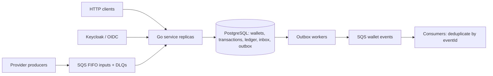

# Distributed Wallet Service

A Go proof of concept for concurrent wallet transactions, idempotency, and failure recovery.

What happens when several service instances receive the same bet, two withdrawals compete for the same balance, or a process crashes after committing a transaction? This project explores those cases with a PostgreSQL ledger, authenticated HTTP and SQS inputs, and transactional inbox/outbox processing.

The implementation supports BET, WIN, LOSS, REFUND, and ROLLBACK. Its focus is financial correctness under retries and competing requests, with executable evidence and explicit operational limits.

## What this demonstrates

| Property | Mechanism | Example verification |
| --- | --- | --- |
| Exact money and nonnegative balances | Integer cents, domain validation, PostgreSQL constraints | Parsing/overflow tests; two bets of 80 competing for a balance of 100 |
| Consistency across instances | Wallet row locks, version checks, atomic SQL commits | Three independent processes; eight wallets receiving 80 concurrent bets |
| Durable idempotency | Provider-scoped unique keys, canonical payload hash, stored results | 50 identical bets produce one debit; replays return the historical balance |
| Auditable state | Append-only ledger, protected terminal states, snapshot reconciliation | SQL mutation guards and deliberate drift detection |
| Recovery after interruption | Transactional inbox/outbox, leases, retries, pending-reference worker | Real process termination after commit and after event publication |
| Provider isolation | OIDC claims, provider-filtered queries, broker IAM policies | Real token validation and broker allow/deny checks |

**Scope:** a locally reproducible PoC, with at-least-once event delivery. It does not claim production readiness, exactly-once messaging, strict event ordering, or measured throughput. See [architecture and tradeoffs](ARCHITECTURE.md), [test coverage](docs/REQUIREMENTS.md), and [dated validation results](docs/VALIDATION.md).

## Architecture at a glance



HTTP handlers and SQS consumers share the same financial use case. A database transaction commits the operation, balance, ledger, outbox, and applicable inbox record together. Publishing happens after that commit; consumers must handle duplicate events and gaps in `walletVersion`.

Stack: Go 1.27.1, PostgreSQL 17.6, pgx, Uber Fx, Keycloak 26.7.4, and MiniStack 1.5.17 with IAM enforcement enabled. Images and dependencies use explicit versions, and `go.sum` is committed.

## Quick start

Requires Docker Engine and Compose v2 with `--wait` support (validated with Engine 25.0.2 / Compose 2.19.1). Default infrastructure ports are 55432 (PostgreSQL), 54566 (SQS), and 58080 (Keycloak). Ports bind to loopback; credentials are local development examples.

```sh
docker compose up --build --scale app=3 -d --wait
BASE="http://$(docker compose port --index 1 app 8080)"
curl "$BASE/health/live"
curl "$BASE/health/ready"
python3 scripts/smoke.py
```

Each replica receives a dynamic local port. Use `--index 2` or `--index 3` to discover the others; check ports again after recreating containers. Starting without `--scale` runs one instance.

Compose provisions migrations, Keycloak clients, FIFO queues, DLQs, and IAM identities/policies. Broker initialization fails if the expected allow/deny checks fail. The authenticated smoke test creates a unique wallet and verifies all five operation types, isolation, historical replay, pagination, and reconciliation. Expected final balance: **85.00 BRL**, version **5**, **five ledger entries**. It preserves the test data and prints the wallet ID.

For interactive exploration, import the [Postman collections and environment](docs/postman/README.md), or follow the [manual walkthrough](docs/MANUAL.md). Postman includes five concurrency scenarios with automatic authentication and financial-state assertions.

## Authentication and a first transaction

Health endpoints are public. Business endpoints and `/metrics` require tokens. Local Keycloak is at `http://localhost:58080`, with console credentials `local-admin` / `local-admin-only`, issuer `http://localhost:58080/realms/jungle`, and audience `jungle-wallet`.

Service clients are `wallet-internal`, `provider-a`, `provider-b`, and `metrics-reader`; each demo secret is `<clientId>-local-secret`. Normal tokens expire after 120 seconds. The `expired-token` and `wrong-audience` clients support negative tests.

The following uses Python 3 to read JSON and generate a new player ID:

```sh
token() {
  curl -fsS http://localhost:58080/realms/jungle/protocol/openid-connect/token \
    -d grant_type=client_credentials -d "client_id=$1" \
    -d "client_secret=$1-local-secret" \
    | python3 -c 'import json,sys; print(json.load(sys.stdin)["access_token"])'
}
TOKEN_INTERNAL=$(token wallet-internal)
TOKEN_PROVIDER=$(token provider-a)
PLAYER_ID=$(python3 -c 'import uuid; print(uuid.uuid4())')
WALLET_ID=$(curl -fsS "$BASE/wallets" \
  -H "Authorization: Bearer $TOKEN_INTERNAL" -H 'Content-Type: application/json' \
  -d "{\"playerId\":\"$PLAYER_ID\",\"initialBalance\":{\"amount\":\"100.00\",\"currency\":\"BRL\"}}" \
  | python3 -c 'import json,sys; print(json.load(sys.stdin)["id"])')
BET_ID="demo-bet-$PLAYER_ID"

curl -sS "$BASE/wagering/transactions" \
  -H "Authorization: Bearer $TOKEN_PROVIDER" \
  -H 'Content-Type: application/json' -H "Idempotency-Key: $BET_ID" \
  -d "{\"providerId\":\"provider-a\",\"externalTransactionId\":\"$BET_ID\",\"playerId\":\"$PLAYER_ID\",\"walletId\":\"$WALLET_ID\",\"roundId\":\"demo-round\",\"gameId\":\"demo-game\",\"kind\":\"BET\",\"money\":{\"amount\":\"25.00\",\"currency\":\"BRL\"}}"

curl -sS "$BASE/wallets/$WALLET_ID/ledger?limit=50" -H "Authorization: Bearer $TOKEN_INTERNAL"
curl -sS -X POST "$BASE/wallets/$WALLET_ID/reconciliation" -H "Authorization: Bearer $TOKEN_INTERNAL"
curl -sS "$BASE/providers/provider-a/wagering/transactions/$BET_ID" -H "Authorization: Bearer $TOKEN_PROVIDER"
```

Resend the same bet with the same body and key: `idempotentReplay=true`, without another debit. The result retains the balance observed during its original execution. Reopening the same player/currency pair returns 409. See [HTTP codes and authorization rules](ARCHITECTURE.md#http-and-reconciliation).

## Development and verification

Go 1.27.1 is selected in `go.mod`; automatic toolchain download can supply it without changing the global installation. The race detector requires a C compiler (GCC or Clang).

```sh
make infra             # Infrastructure, IAM files in work/, and migrations
cp .env.example .env   # Local settings; ignored by Git
set -a
. ./.env
set +a
go run ./cmd/server    # http://127.0.0.1:58000
```

`work/*.json` contains generated local IAM credentials and must remain untracked. Running app containers also consume the queues.

```sh
go test ./...
go test -race ./...
go vet ./...
go mod verify
GOTOOLCHAIN=go1.27.1 go run golang.org/x/vuln/cmd/govulncheck@latest ./...
make clean-check
```

`make clean-check` is the reproducible, isolated verification entry point. It copies sources into `work/`, creates a separate Compose project with empty volumes, provisions dependencies, runs unit/race checks, vet, module verification and integration tests, then builds the final image, starts three replicas and runs the authenticated smoke test. It removes only its own containers and volumes; the source copy remains for inspection. Additional prerequisites: `tar`, `curl`, `mktemp`, and Python 3. Override its ports (55433, 54567, 58081) with `VERIFY_POSTGRES_PORT`, `VERIFY_SQS_PORT`, and `VERIFY_KEYCLOAK_PORT`.

The integration suite uses real infrastructure and three independent processes compiled with `-race`. It covers concurrency, authentication, inbox/outbox, DLQ, reversals, reference recovery, database constraints, migration rollback and Fx lifecycle. Its ten-minute timeout accommodates real lease and visibility intervals.

For targeted isolated checks:

```sh
./scripts/clean-check.sh -run 'TestHTTPBoundaryAudit|TestStorageAudit'
./scripts/clean-check.sh -run '^(TestHTTPCommitCrash|TestSQSCommitBeforeACKCrash|TestPublishBeforeConfirmationCrash)$'
go test ./internal/domain -fuzz=FuzzMoneyRoundTrip -fuzztime=20s
```

Crash tests build with `-tags=failpoints`; normal images do not contain the termination points. Marker files prove each injected crash occurred and allow another process to recover.

`make integration` (equivalent to `scripts/integration.sh`) instead uses the **current Compose project** and stops/restarts PostgreSQL and SQS during outage tests. Use it only in a dedicated test environment, with app replicas stopped (`docker compose stop app`, then `make infra`). Test IDs are unique; migration/storage tests use temporary databases. The drift test introduces and restores corruption in its own wallet.

## Messaging

`infra/ministack/bootstrap.py` provisions one input FIFO queue per provider, each with a DLQ, 30-second visibility timeout, and `maxReceiveCount=5`. All output events go to `wallet-events.fifo`.

See [message contracts and examples](docs/EVENTS.md). Commands require `data.idempotencyKey`; send with `MessageGroupId=walletId` and `MessageDeduplicationId=messageId`. After `make infra`, role-specific credentials are in `work/provider-a.json`, `work/provider-b.json`, `work/worker.json`, and `work/observer.json`. SDK/CLI clients use endpoint `http://localhost:54566` and region `us-east-1`.

`TestService/SQSAndHTTPIdempotency` forces ten actual deliveries of one operation and verifies that a conflicting inbox message reaches the DLQ. Event consumers must persist deduplication by `eventId` and reconcile projection gaps using `walletVersion`.

## Configuration, migrations, and shutdown

Application settings are listed in `.env.example`: `DATABASE_URL`, `OIDC_ISSUER`, `OIDC_JWKS_URL`, `OIDC_AUDIENCE`, `HTTP_ADDR`, `SQS_ENDPOINT`, and `BROKER_CREDENTIALS_FILE`. Compose infrastructure ports can be changed with `POSTGRES_PORT`, `SQS_PORT`, and `KEYCLOAK_PORT`. The application reads a mounted worker credential file; it does not use bootstrap administrator credentials.

SQL migrations are embedded in the binary. `up` is idempotent and serialized by an advisory lock:

```sh
docker compose run --rm migrate up
# Local equivalent, using the migration identity:
DATABASE_URL='<migration-user URL>' go run ./cmd/migrate up
```

`migrate down` reverses every installed migration and **deletes the financial tables and their data**. Use it only in a disposable environment with the application stopped. The integration suite verifies up/down/up in a temporary database.

```sh
docker compose down
```

This preserves named volumes. PostgreSQL stores financial state. MiniStack persists state on normal shutdown; its abrupt-crash durability has not been established as equivalent to AWS SQS. Recreating the development Keycloak container imports the realm again and invalidates old tokens.

## Further reading and origin

- [Architecture and decisions](ARCHITECTURE.md): invariants, transaction boundaries, error semantics, security, and operational limits.
- [Guarantees and test coverage](docs/REQUIREMENTS.md): implementation-to-test mapping.
- [Validation evidence](docs/VALIDATION.md): dated results and what they establish.
- [Manual walkthrough](docs/MANUAL.md) and [Postman](docs/postman/README.md): repeatable exploration.
- [Messaging contracts](docs/EVENTS.md): envelopes and consumer responsibilities.

This project originated from Jungle Gaming's Go backend challenge and has been developed into a standalone proof of concept. [Origin and attribution](docs/ORIGIN.md) links the original specification. The repository is published as `distributed-wallet-service`; Go module and runtime identifiers retain `jungle-wallet` for compatibility.
